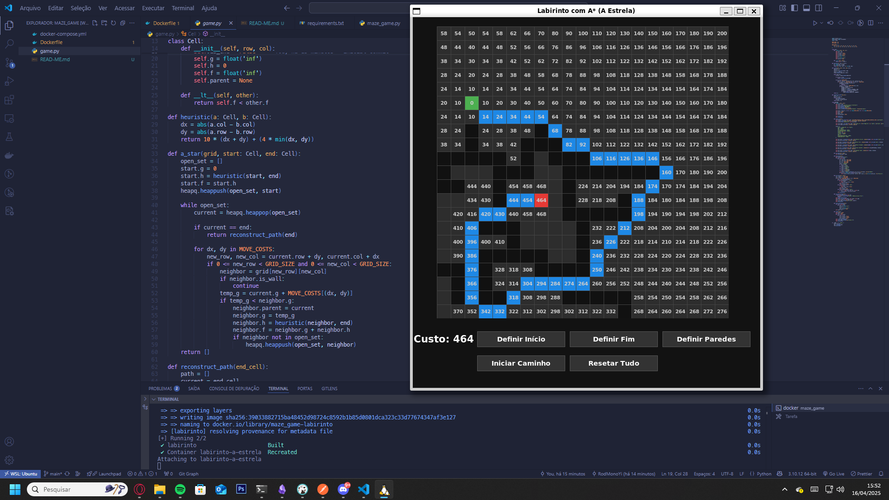
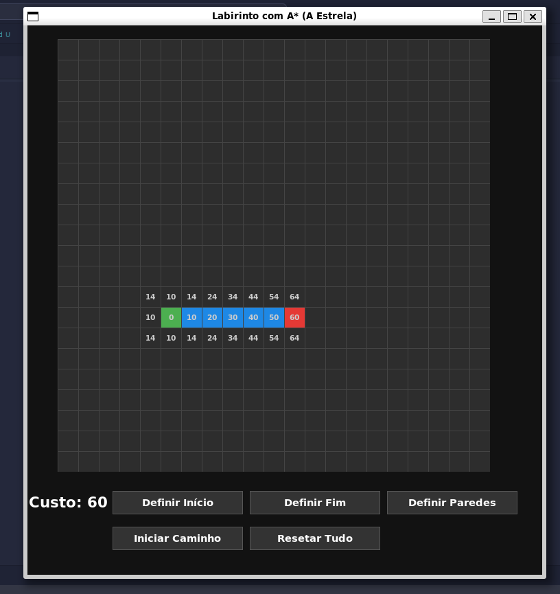
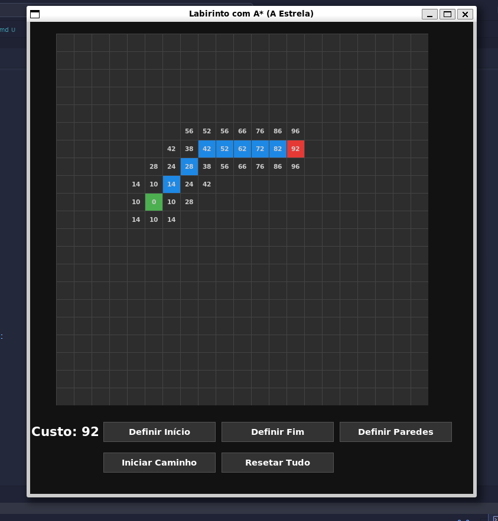
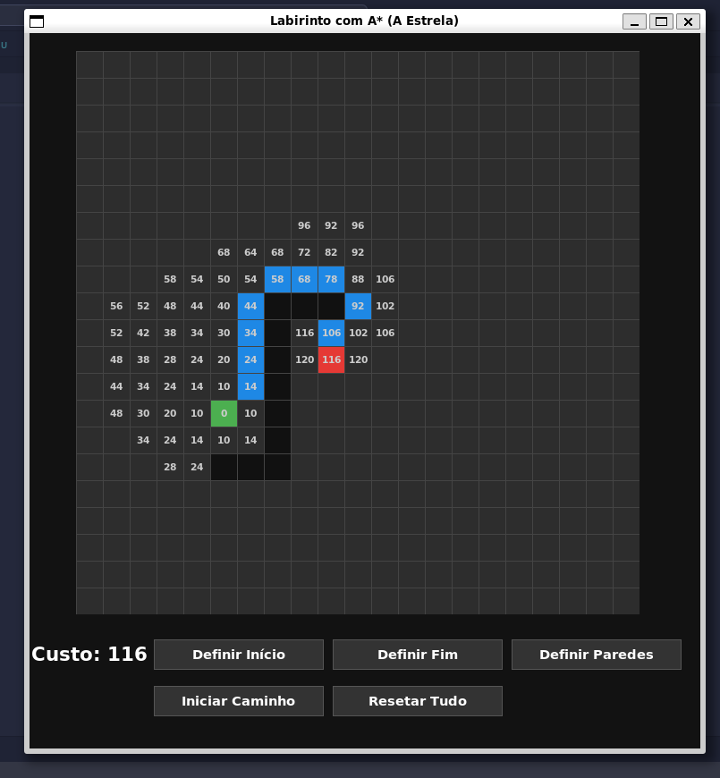
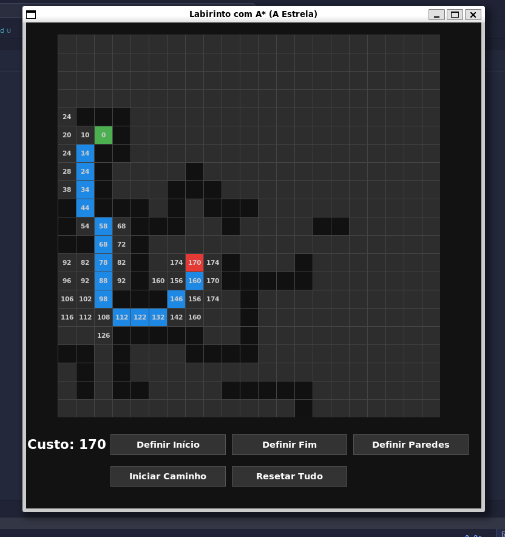

# 🔍 Labirinto com A* (A Estrela) — Python + Tkinter

Um jogo interativo com interface gráfica em Python onde um robô percorre um labirinto utilizando o algoritmo A* (A Estrela) para encontrar o caminho mais eficiente com base em custos de movimentação.

<p align="center">
  
</p>

---

## 🚀 Funcionalidades

- Definição de ponto inicial e final do robô
- Posicionamento de paredes no labirinto
- Cálculo automático do melhor caminho usando A*
- Visualização do custo de cada célula e do percurso total
- Interface gráfica intuitiva
- Ambiente dockerizado 

---

## 📦 Requisitos

- [Docker](https://www.docker.com/)

---

## 🛠️ Como rodar (via Docker)

### 1. Clone o repositório

```bash
git clone https://github.com/seu-usuario/labirinto-a-estrela.git
cd labirinto-a-estrela
```
### 2. Rode o app
```bash
docker-compose up --build
```
4. Finalize
Para parar o app:
```bash
docker-compose down
```

📐 Controles

Botão | Função
🟢 Definir Início | Define a célula onde o robô começa
🔴 Definir Fim | Define o destino final
⬛ Definir Paredes | Cria/remover obstáculos no caminho
🧠 Iniciar Caminho | Executa o algoritmo A*
♻️ Resetar Tudo | Limpa o labirinto


🧠 Algoritmo: A Estrela (A*)
O A* é um algoritmo de busca que usa:

- g(n): custo do caminho até o nó atual
- h(n): heurística (distância estimada até o objetivo)
- f(n) = g(n) + h(n)

Custo dos movimentos:

- ⬆️⬇️⬅️➡️: 10 pontos
- Diagonais: 14 pontos

O objetivo é encontrar o caminho com menor custo total (f).

## 🖼️ Prévia

### Interface completa

<p align="center">
  
</p>

### Outros exemplos

<p align="center">
  
  
  
  
</p>


✨ Tecnologias
- Python 3.11
- Tkinter
- Docker + Docker Compose
- Algoritmo A* (A Estrela)

👨‍💻 Desenvolvedores:

Rodrigo Barreto Rodrigues
 • Desenvolvedor Web Fullstack & Criador de jogos
- Portfólio: https://portfolio-roan-xi.vercel.app
- LinkedIn: https://www.linkedin.com/in/rodrigo-barreto-dev/
- GitHub: https://github.com/RodMonoYi


Deivid Santos
 • Desenvolvedor
- Portfólio:
- LinkedIn: 
- GitHub:


